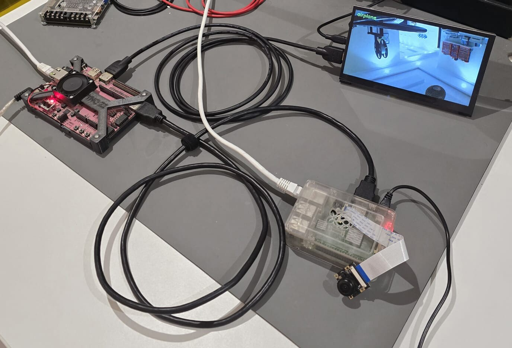
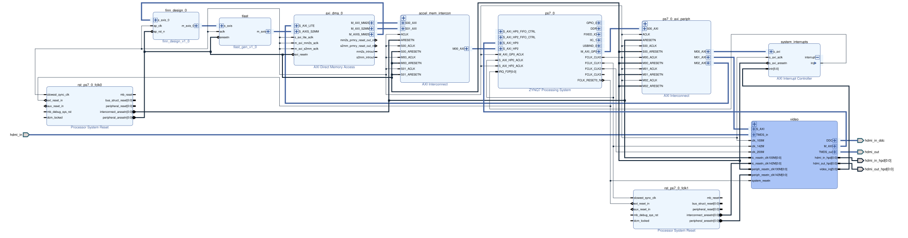
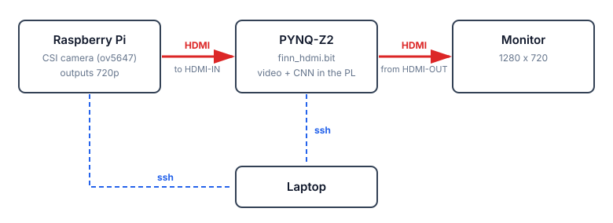
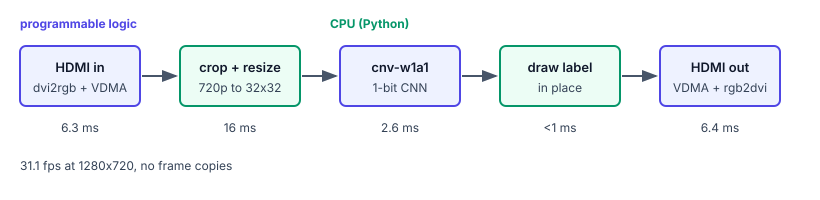

# fpga-video-classifier

A camera feeds a PYNQ-Z2 over HDMI, a binarized CNN in the FPGA classifies every frame, and the
labelled frame goes back out over HDMI. Video and the network share one bitstream.



[](docs/block-diagram.svg)

| | |
|---|---|
| 31.1 fps | 1280x720, the camera's limit |
| 2.59 ms | per inference |
| 45.9 GOPS | 59.5 M MACs per frame |
| 2.65 W | whole chip, about 0.5 W of it the CNN |
| 188 KiB | 1-bit weights, all in BRAM |
| 0 | DSPs |



## Run

On the Pi:

```bash
scp pi/* pi@<pi>:~/
ssh pi@<pi> './campreview.sh &'
ssh pi@<pi> 'python3 pisource.py'    # expect: sending 1280x720@60.00 74.250 ...
```

If it sends nothing: `sudo ./set-hdmi-mode.sh --apply` and reboot.

On the board:

```bash
git clone git@github.com:AbdullahAlNafisah/fpga-video-classifier.git
cd fpga-video-classifier
sudo -s
source /etc/profile.d/pynq_venv.sh
source /etc/profile.d/xrt_setup.sh
python3 board/pipeline.py
```

```
bird    read 6.3 ms   infer 19.4 ms   out 6.4 ms   31.1 fps
```

`bash board/runlive.sh` runs it detached, logging to `/tmp/pipeline.log`.

## Where the time goes



The resize runs on the ARM, and this OpenCV build has no NEON.

## Network

cnv-w1a1 from [BNN-PYNQ](https://github.com/Xilinx/BNN-PYNQ), trained with
[Brevitas](https://github.com/Xilinx/brevitas/tree/master/src/brevitas_examples/bnn_pynq), compiled
by [FINN](https://github.com/Xilinx/finn). CIFAR-10, 84.22% top-1, 1-bit weights and activations.
23,182 LUT, 95 BRAM36 + 15 BRAM18.

CIFAR-10 has no "none of these" class, so most scenes get a guess.

To rebuild the bitstream: [build/](build/README.md).

## License

MIT
